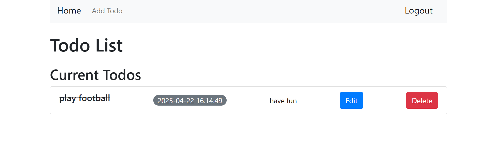
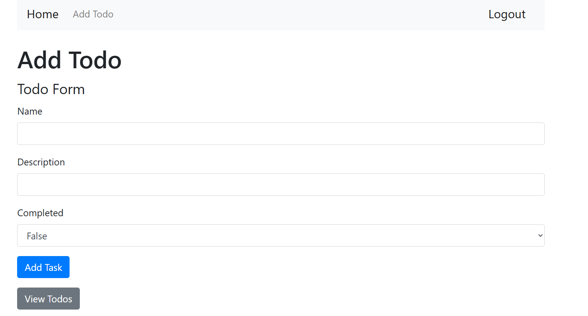
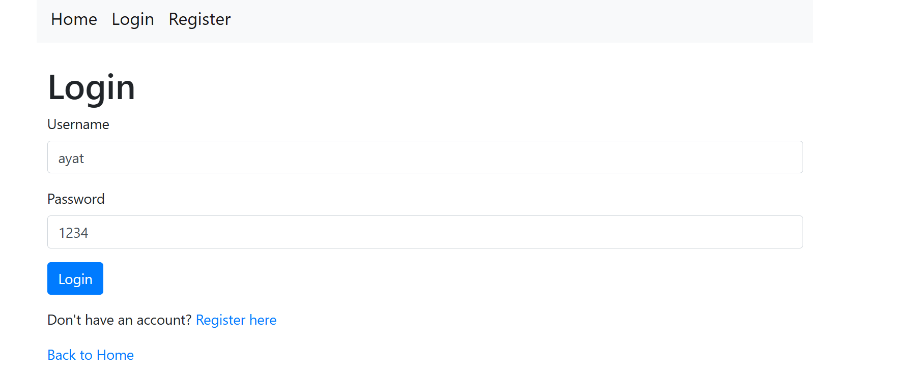
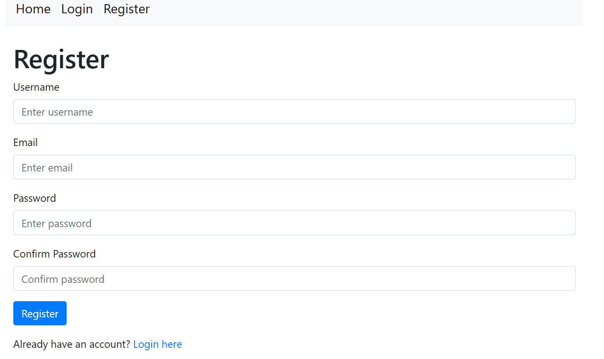

# 📋 Todo Flask App

A simple ToDo web application built using Flask, MongoDB, and JWT authentication. Users can register, log in, and manage their personal todo tasks (add, edit, delete) securely.

---

## 🚀 Features

- User authentication using JWT
- Register and login system
- Add new todos
- Edit existing todos
- Delete todos
- View todos (only your own)
- Session management using Flask sessions

---

## 💠 Tech Stack

- **Flask** – Python web framework
- **Flask-JWT-Extended** – For JWT authentication
- **Flask-WTF** – Form handling and validation
- **MongoDB** – NoSQL database (with PyMongo)
- **HTML & Bootstrap** – For front-end

---

## 📂 Project Structure

```
Todo_Flask/
│
├── app.py                 # Main Flask app
├── forms.py               # Form definitions (ToDoForm, RegisterForm, LoginForm)
├── templates/             # HTML templates
│   ├── layout.html
│   ├── login.html
│   ├── register.html
│   ├── add_todo.html
│   └── view_todos.html
├── requirements.txt       # Python dependencies
└── README.md              # This file
```

---

## 📦 Installation

### Prerequisites

- Python 3.7+
- MongoDB installed and running locally (or use MongoDB Atlas)

### Steps

1. **Clone the repository**
```bash
git clone https://github.com/Ayat166/Todo_Flask.git
cd Todo_Flask
```

2. **Create and activate a virtual environment**
```bash
python -m venv venv
source venv/bin/activate  # On Windows use venv\Scripts\activate
```

3. **Install dependencies**
```bash
pip install -r requirements.txt
```

4. **Set environment variables**
Create a `.env` file or export variables in your shell:
```bash
export SECRET_KEY='your-secret-key'
export JWT_SECRET_KEY='your-jwt-secret-key'
```

5. **Run the app**
```bash
python app.py
```

Visit: [http://localhost:5000](http://localhost:5000)

---

## ✅ Usage

- Register a new account
- Log in
- Add your todos from the dashboard
- Edit or delete them as needed
- You will only see todos associated with your account

---

## 📷 Screenshots

- Homepage

- Add Todo form

- Login/Register page


---

## 💡 Future Improvements

- Password hashing and security enhancement
- Pagination for todo list
- Filtering by completion status
- API endpoints for mobile or frontend use

---

## 👩‍💻 Author

**Ayat Ali** – [GitHub](https://github.com/Ayat166)

---

## 📄 License

This project is licensed under the MIT License – see the [LICENSE](LICENSE) file for details.

